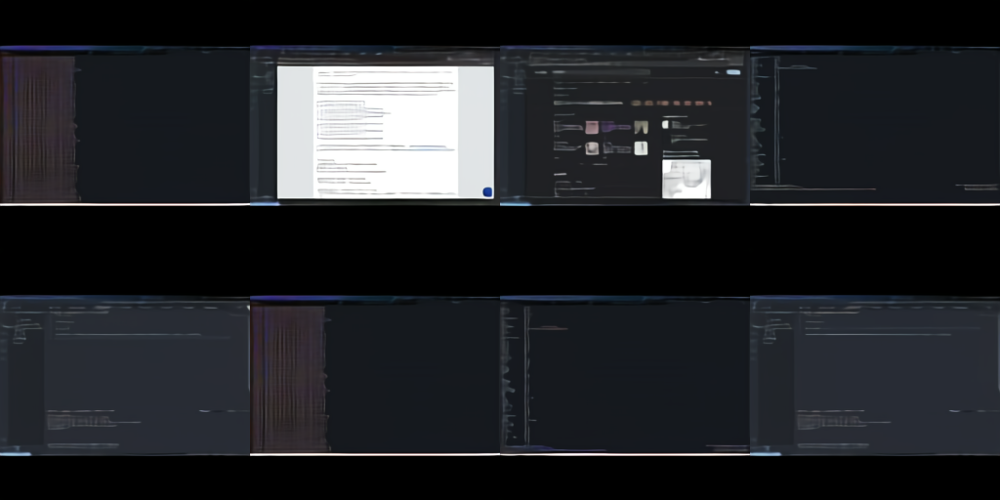

# BYOZ — Broadcast Your Own Z

## What is this?

BYOZ (Broadcast Your Own Z) is my personal experiment where I record every minute of my working screen via [the discrete VAE](https://github.com/openai/DALL-E) and publish the latent representations computed by the model. The latent variable in VAEs is `z`, which is where the name comes from.

The script I use for recording my screen can be found here: [byoz](byoz) (this works only on Mac).

## Reconstructed image



## Logged time
```
 120 20210813
  90 20210821
  90 20210822
  30 20210823
  90 20210824
  90 20210825
  90 20210826
  60 20210827
  90 20210828
  60 20210829
  60 20210830
  90 20210831
 210 20210902
  90 20210903
  90 20210904
  90 20210905
  90 20210906
  90 20210907
  90 20210908
  90 20210909
  60 20210910
  60 20210911
  90 20210912
  90 20210913
 210 20210914
 330 20210915
 240 20210916
  60 20210917
 120 20210918
 120 20210919
  90 20210920
  60 20210921
  90 20210922
  90 20210923
 238 20210924
  90 20210925
  90 20210926
 120 20210927
 120 20210928
  90 20210929
 120 20210930
 210 20211001
  90 20211002
 120 20211003
  90 20211004
 240 20211005
 120 20211006
 180 20211007
  90 20211008
  90 20211009
  90 20211010
  90 20211011
 180 20211012
  90 20211013
  90 20211014
  90 20211015
 120 20211016
 300 20211017
 120 20211018
 390 20211019
  90 20211020
  90 20211021
  30 20211022
  90 20211023
  90 20211024
 180 20211025
  60 20211026
  90 20211027
  90 20211028
  90 20211029
  90 20211030
 120 20211031
  90 20211101
  90 20211102
 120 20211103
  60 20211104
  60 20211105
  60 20211106
  90 20211107
 120 20211108
  90 20211109
  30 20211110
  30 20211111
```
